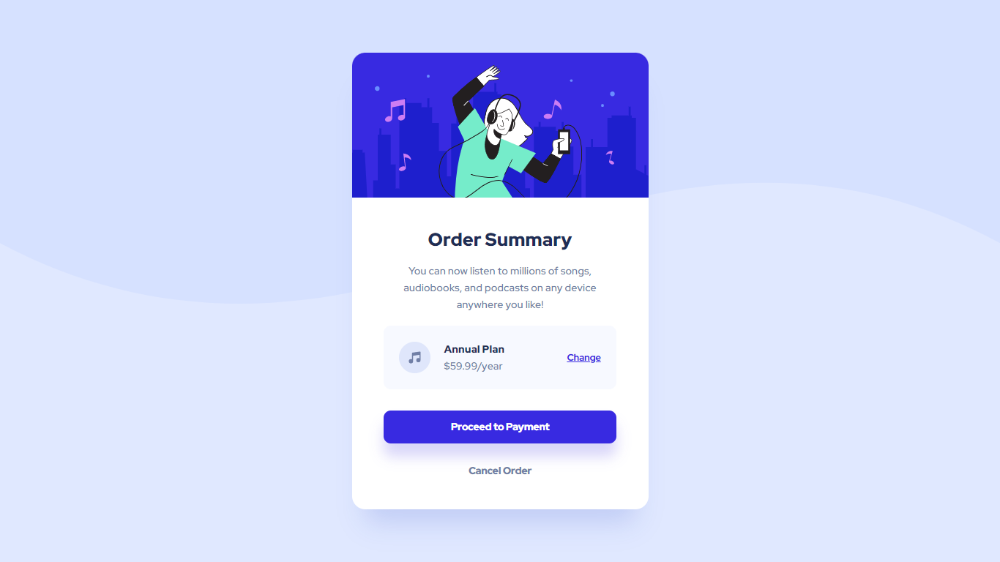

# order-summary

O **Order Summary** é o primeiro de uma sequência de desafios de front-end que está sendo realizado no Scuba Team da Alura, a fim de colocar em prática os conhecimentos adquiridos.

Este projeto foi criado com design do Figma disponibilizado pelo [Frontend Mentor](https://www.frontendmentor.io/). É um simples modal, que exige conhecimentos básicos de HTML e CSS, além de alguns mais intermediários como Flexbox e Responsividade. Procurou-se realizar o projeto da forma mais próxima possível do mundo real, criando este repositório e realizando commits para cada etapa realizada, bem como solicitações e aprovações de *Pull Requests*.